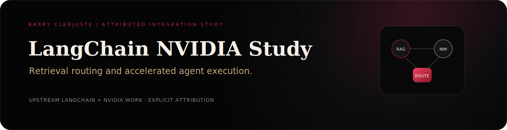
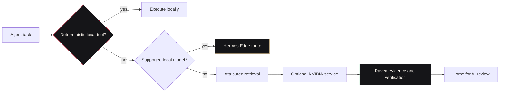

  

  
  
  

# Barry Clerjuste's integration study

**Maturity:** Attributed integration study.

This repository is based on upstream LangChain and NVIDIA integration work. Barry Clerjuste does **not** claim ownership of LangChain, NVIDIA NIM, NVIDIA NeMo, TensorRT, or the original integration packages.

The purpose of this study is to explore how accelerated retrieval and model services can fit into a broader local-first agent architecture without erasing source attribution or pretending remote acceleration is local execution.

## Study questions

- When should an agent use deterministic local tools, local models, retrieval, or an NVIDIA-hosted service?
- Which route metadata should remain visible to the operator?
- How should a system distinguish evidence retrieval from generated synthesis?
- What latency, privacy, cost, and failure signals should trigger fallback?
- How can accelerated services complement rather than silently replace local-first workflows?

## Raven ecosystem mapping

| Raven system | Integration-study role |
|---|---|
| [Home for AI](https://github.com/simpliibarrii-crypto/home-for-ai) | Operator-facing route selection, service status, and evidence display |
| [Hermes Edge](https://github.com/simpliibarrii-crypto/hermes-edge) | Local tool and model route before remote acceleration |
| [Raven AI](https://github.com/simpliibarrii-crypto/raven-ai) | Evidence Graph, verification, confidence, and scientific output gates |
| JSpace Chain | Observable route, risk, reflection, and fallback policy |
| [OpenClinical AI](https://github.com/simpliibarrii-crypto/openclinical-ai) | Consent and privacy boundary for any clinical workflow integration |

## Route model

## Attribution rules

1. Preserve upstream copyright, licenses, package names, and contributor history.
2. Identify Barry's additions as examples, experiments, documentation, or integration analysis.
3. Do not use Raven ecosystem branding to imply an official LangChain or NVIDIA partnership.
4. Link material claims to upstream documentation, source code, benchmark evidence, or clearly labeled engineering inference.
5. Keep local execution, hosted APIs, and simulated browser demonstrations visibly distinct.

## Public proof

- [Interactive integration case study](https://simpliibarrii-crypto.github.io/project.html?project=langchain-nvidia)
- [Research archive](https://simpliibarrii-crypto.github.io/research.html)
- [Complete AI engineering portfolio](https://simpliibarrii-crypto.github.io/)

## Canonical upstream

Review the upstream project and its licensing before using or redistributing integrations:

- https://github.com/langchain-ai/langchain-nvidia

This file documents Barry Clerjuste's study layer only. The repository's upstream README and package documentation remain the authority for the underlying integrations.
